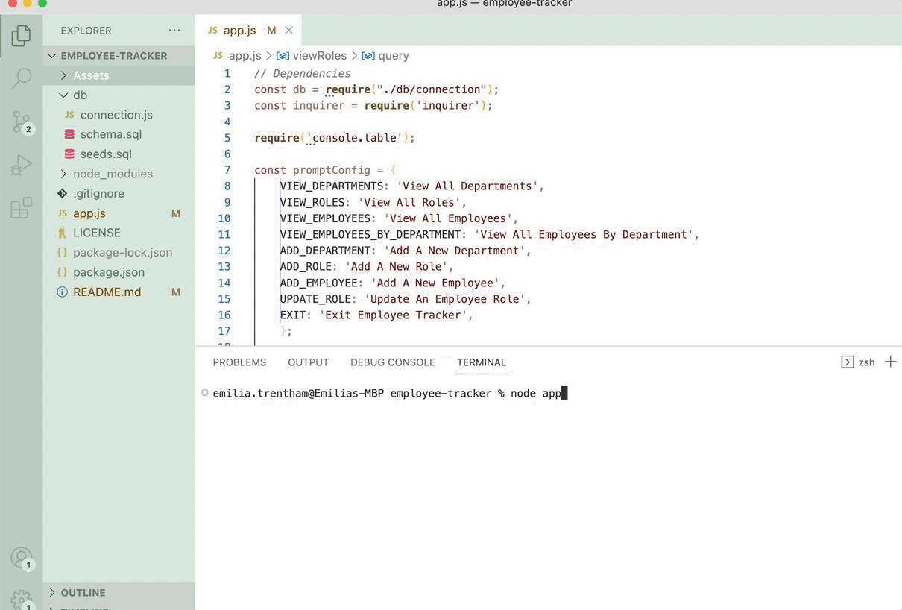

# employee-tracker

  
 


## Description 

Employee Tracker is a CLI application used to build and maintain employee data bases that can scale appropriatley with a companie's growth without reconfiguring the core structure of the internal employee data base.

## User Story

```
AS A business owner
I WANT to be able to view and manage the departments, roles, and employees in my company
SO THAT I can organize and plan my business
```

## Table of Contents 
* [Photos](#screenshots)
* [Installation](#installation)
* [Usage](#usage)
* [Features](#features)
* [License](#license)
* [Socials](#questions)

## Photos




## Installation
- Run `npm i` to install the dependencies that have been loaded into the json files. 
- Run `node app.js` to start the prompts that will guide the user through the various tasks the application can perform.

## Usage 
- View departments, roles, and employees. 
- View employees by department. 
- Add departments, roles, and employees. 
- Update employee roles. 
- Update employee managers. 

## Features

- `MySQL` - Relational database management system based on SQL – Structured Query Language, used in this applicationt to warehouse and query employee and company data.

- `InquirerJs` - NPM package to interact with the user via the command-line.
- `console.table` - Used to print MySQL rows to the console. 
- `Node.js` - Used for package managment and to execute the JavaScript code that builds the server-side command line scripting  tool.
- `Javascript` - Used to base functionality  within the application.
- `Git` - Version control system used to track source code changes.


## License

MIT License

---

## Questions?


Reach out with any questions!

GitHub: [emiliatrentham](https://github.com/emiliatrentham)

[](https://www.linkedin.com/in/emilia-trentham-987a59164/)
## Acceptance Criteria

<!-- ```md
GIVEN a command-line application that accepts user input
WHEN I start the application
THEN I am presented with the following options: view all departments, view all roles, view all employees, add a department, add a role, add an employee, and update an employee role
WHEN I choose to view all departments
THEN I am presented with a formatted table showing department names and department ids
WHEN I choose to view all roles

THEN I am presented with the job title, role id, the department that role belongs to, and the salary for that role


WHEN I choose to view all employees
THEN I am presented with a formatted table showing employee data, including employee ids, first names, last names, job titles, departments, salaries, and managers that the employees report to

WHEN I choose to add a department
THEN I am prompted to enter the name of the department and that department is added to the database
WHEN I choose to add a role
THEN I am prompted to enter the name, salary, and department for the role and that role is added to the database
WHEN I choose to add an employee
THEN I am prompted to enter the employee’s first name, last name, role, and manager, and that employee is added to the database
WHEN I choose to update an employee role
THEN I am prompted to select an employee to update and their new role and this information is updated in the database  -->